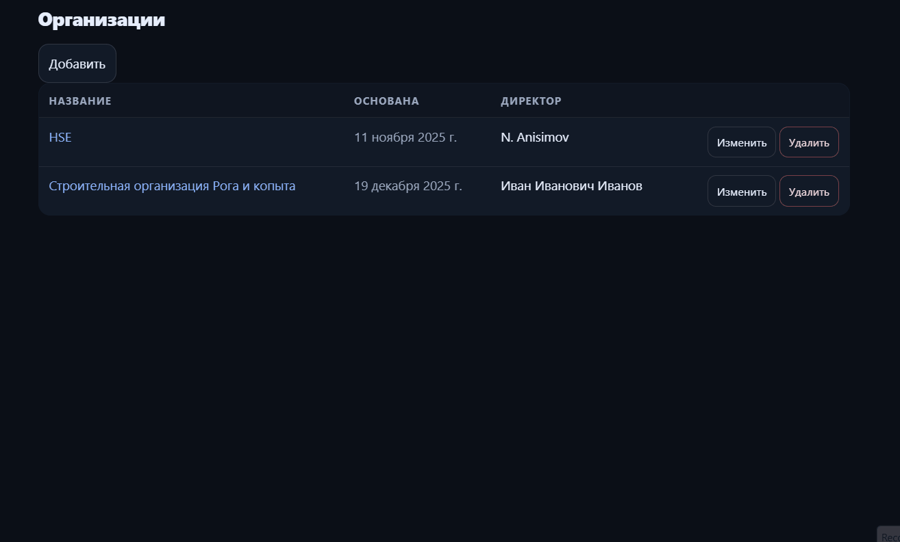
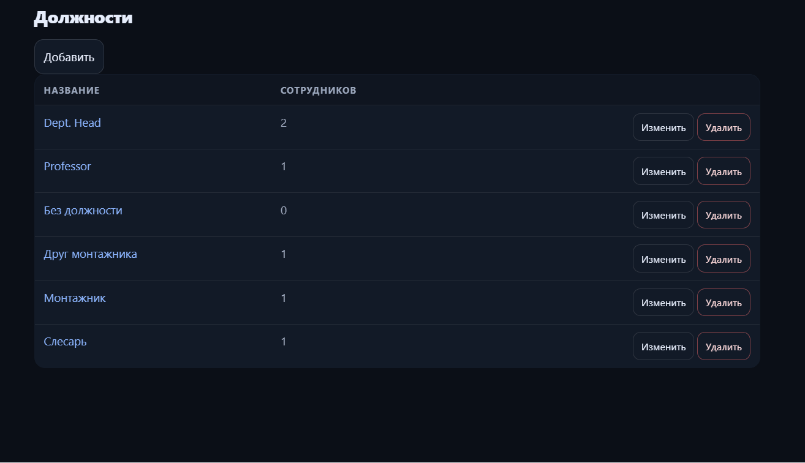
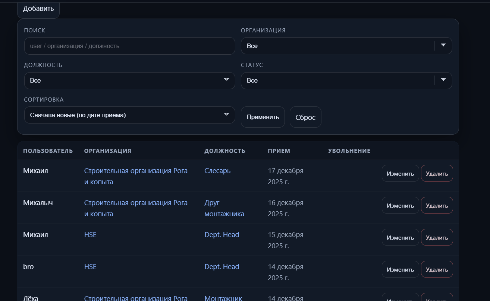
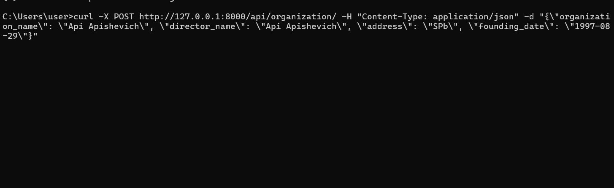
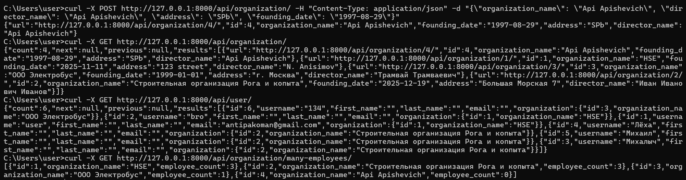

#  Практические 1 и 2 (вариант 2) Шахов Илья

Мини-приложение для учета сотрудников в организациях

### Практическая работа 1 

Реализован базовый веб-интерфейс для управления

**Организациями**

**Должностями**

**Сотрудниками в организациях** ( пользователь <-> организация)

##### Демонстрация
 

---

### Практическая работа 2 

К приложению добавлен REST API

`GET, POST, PATCH, DELETE` для Organizations

`GET` для `Users` с вложенной информацией об организации

Кастомный эндпоинт `organization/many-employees/` для получения списка организаций с наибольшим числом сотрудников

